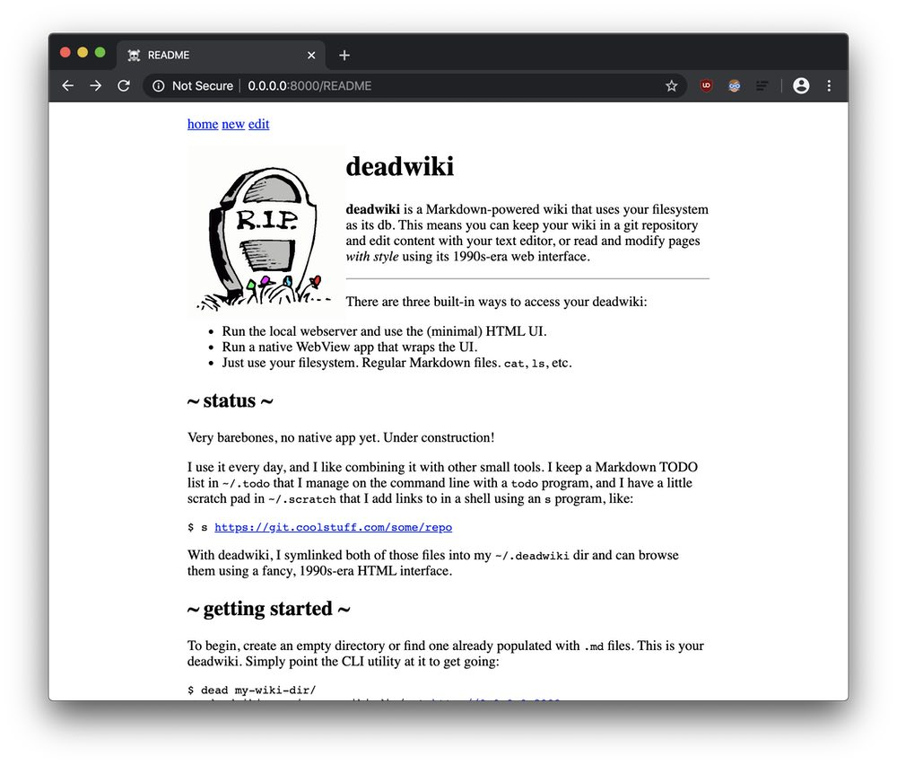
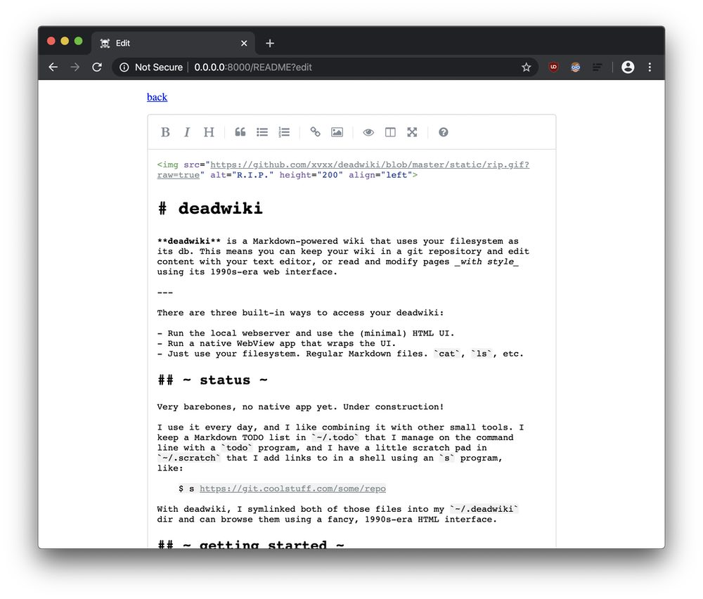

# deadwiki

**deadwiki** is a Markdown-powered wiki that uses your filesystem as
its db. This means you can keep your wiki in a git repository and edit
content with your text editor, or read and modify pages _with style_
using its 1990s-era web interface.

---

There are three built-in ways to access your deadwiki:

- Run the local webserver and use the (minimal) HTML UI.
- Run a native WebView app that wraps the UI.
- Just use your filesystem. Regular Markdown files. `cat`, `ls`, etc.

## ~ status ~

Very barebones, no native app yet. Under construction!

I use it every day, and I like combining it with other small tools. I
keep a Markdown TODO list in `~/.todo` that I manage on the command
line with a `todo` program, and I have a little scratch pad in
`~/.scratch` that I add links to in a shell using an `s` program,
like:

    $ s https://git.coolstuff.com/some/repo

With deadwiki, I symlinked both of those files into my `~/.deadwiki`
dir and can browse them using a fancy, 1990s-era HTML interface.

## ~ getting started ~

To begin, create an empty directory or find one already populated with
`.md` files. This is your deadwiki. Simply point the CLI utility at it
to get going:

    $ dead my-wiki-dir/
    -> deadwiki serving my-wiki-dir/ at http://0.0.0.0:8000

Now visit http://0.0.0.0:8000/ in your browser! (Or don't. It's up to
you.)

You can edit wiki pages locally with something like `vim`, or by using
the web UI. Edits show up instantly, as do new pages - there is no
database and no fancy pantsy caching. Just you, your filesystem, and a
dream.

In addition to [CommonMark], Markdown files can link to each other by
putting the `[Page Name]` in brackets. Like most wikis, it'll either
be a link to the actual page or a way to create it.

## ~ keyboard shortcuts ~

Wiki editing uses [SimpleMDE], so check out their [keyboard
shortcuts][keys].

In addition, if you're in the web UI you can use these:

| **Shortcut**   | **Notes**                        |
| -------------- | -------------------------------- |
| `Double Click` | Enters edit mode for a wiki page |
| `ESC`          | Exits edit mode                  |
| `Ctrl+Enter`   | Submits your edits               |
| `Cmd+Enter`    | Same                             |

## ~ installation ~

Hey, how do I get that handy dandy `dead` CLI utility? With [cargo]:

    cargo install deadwiki

Now you should be able to run `dead -h` to see the possibilities.

## ~ hacking ~

The code is in pretty rough shape right now, so enter at your own
risk, but you can hack on it pretty easily using [cargo]:

    $ git clone https://github.com/xvxx/deadwiki
    $ cd deadwiki
    $ cargo run wiki/

There's a basic wiki included that shows off some features.

## ~ future features ~

- search
- jump to page (via fuzzy finder)
- `--git`: automatically `git push` and `git pull` your deadwiki
- `--gopher`: serve wiki pages over gopher too, probably using [phd]
- `*.css` in wiki dir gets included

## ~ philosophy ~

- no database
- text editor/plain text friendly
- prefer server-side rendering
- take your data with you (scm friendly)
- js only for user input, no ui/frameworks (keyboard shortcuts, markdown editor, finder)
- build time matters (72 crates currently, ~22s release ~10s debug)

## ~ screenies ~

|||
|:-:|:-:|
| Rendering Markdown. _Wow._ | Editing Markdown. _Amazing._ |

[cargo]: https://rustup.rs
[simplemde]: https://simplemde.com/
[keys]: https://github.com/sparksuite/simplemde-markdown-editor#keyboard-shortcuts
[commonmark]: https://commonmark.org/
[phd]: https://github.com/xvxx/phd
